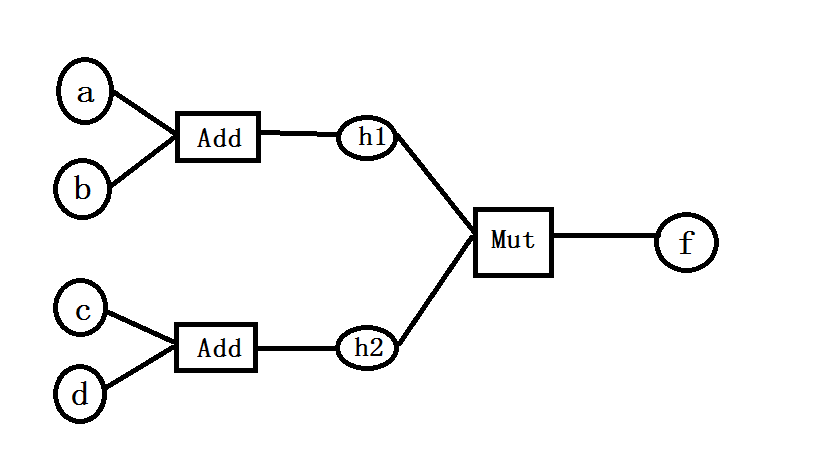

# Computational Graph

具备自动微分（automatic differentiation）功能的计算图。

# Computational Graph Components

* Node

  表示计算单元/节点，保存了计算值和导数值，并记录了生成该节点的计算操作/门对象。

* Gate

  表示计算操作/门，该门是双向的：forward 用以计算从输入计算单元到输出单元的方向（函数值）；backward 用以计算从计算输出单元到输入单元的方向（导数值）。门记录了跟其相关的输入计算单元对象和输出单元计算对象。

* Variable&F

  封装计算节点和计算门、重载常用操作符和数学函数，使得计算图的构建更为简单直观。

## Node

主要有两类计算节点：

1. 常量节点

   没有对应的生成门；导数值恒为零；计算值恒定不变。

2. 变量节点

   一般都有对应一个生成门；导数值会累计；计算值可能会变化。

计算节点的结构，如下图示：


**注**：图中用矩形表示计算门；椭圆形表示计算节点；下面的图片也遵从此例。

## Gate

不同计算操作，对应的计算门也会不同，不过它们都有一个共性：必须具有双向 forward 和 backward 的计算接口。

一个计算门跟一个或者两个输入计算节点相关联，跟一个输出计算节点相关联，如下图：


其中 `forward` 表示数据从输入计算节点流向输出计算节点，用以计算函数值；`backward` 则表示数据从输出计算节点流向输入计算节点，用以计算导数值；

### 计算门和计算节点

计算节点和计算门是构造计算图的基本组件。定义计算图的示例：

```
# 定义 f = (a+b) * (c+d) 的计算图
a, b, c, d = 1, 2, 3, 4
h1 = AddGate(Node(a), Node(b)).output()  # 返回 AddGate 的输出计算节点
h2 = AddGate(Node(c), Node(d)).output()  # 返回 AddGate 的输出计算节点
f = MultiplyGate(h1, h2).output()  # 返回 MultiplyGate 的输出计算节点；计算图构造完成
```

该示例的计算图结构如下：




**注**：计算图是由计算节点和计算门组成的二分图

### 支持的计算门

如果按照计算门输入的计算节点数量来分，目前有一元和二元计算门：

**一元计算门**

* `ExpGate`
* `SigmoidGate`
* `ReLUGate`
* `PositiveGate`
* `NegativeGate`
* `AbsoluteGate`

**二元计算门**

* `AddGate`
* `SubtractGate`
* `MultiplyGate`
* `DivideGate`
* `MaxGate`
* `MinGate`
* `PowGate`

### 自定义计算门

如果有的计算操作，目前没有提供支持的计算门，那可以自定义计算门，实现起来也十分简单：

1. 继承类 `Gate` 来定义自己的计算门类。
2. 在类中可以通过 `in_node1` 和 `in_node2` 来访问输入节点，通过 `out_node` 来访问输出节点。
3. 在类中实现方法 `forward`：该方法不接受任何参数；返回值是输出计算节点的计算值。
4. 在类中实现方法`backward`：该方法不接受任何参数；返回值是一个列表，含有各个输入节点的导数值。

## Variable&F

虽然有了 `Node` 和各种 `Gate` 就可以构造计算图，但直接操纵它们并不直观，如上例中，需要精确指定节点和门的关系来定义计算图：

```
# 定义 f = (a+b) * (c+d) 的计算图
a, b, c, d = 1, 2, 3, 4
h1 = AddGate(Node(a), Node(b)).output()
h2 = AddGate(Node(c), Node(d)).output()
f = MultiplyGate(h1, h2).output()
```

我们希望像定义数学公式一样来定义计算图，如：

```
a, b, c, d = Variable(1), Variable(2), Variable(3), Variable(4)
f = (a+b) * (c+d)
```

是不是更加简洁直观呢？

这样简洁的方式，得益于 Python 对运算符重载机制的支持。我们通过 `Variable` 来封装 `Node` 和 `Gate`，并通过运算符重载机制，来为代码中的运算符适配计算门。至于无法通过运算符重载的计算操作，则通过 `F` 类的静态方法来实现。详见 `Variable` 类和 `F` 类。